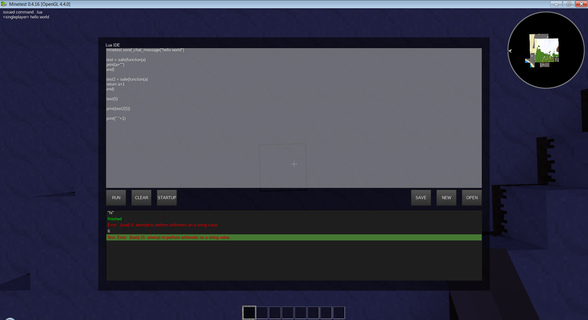

# CSM DTE
## Client Side Mod Designing & Testing Environment
An ingame lua editor for minetest with some useful features.

This can be used for creating, testing and using CSMs without reloading the game, and without the game crashing.
It was tested with multiple CSMs from the minetest forums, and they all worked

CSMs can be created, or pasted in, and they should work exactly the same as they would normaly, except errors won't crash the game

functions that are registered with minetest can be put in a function `safe(func)` to output errors to the UI when minetest calls them

scripts can be put in startup to run them automatically when the game loads. errors are also put in the UI

screenshot:

## FEATURES:
- print function
- coloured error output
- easy UI
- multiple files
- file creation and deletion
- safe function execution
- automatically run files at startup
- create full CSMs

## To Use:
- use the command `.lua` to open the IDE
- write code or paste it in
- run it, save it, put it in startup
- detailed instructions at top of `init.lua` file. 

## How to install
- make sure you have `enable_client_modding = true` in your `minetest.conf` file
- download and extract the zip file into `clientmods\lua_ide` or paste the `init.lua` file into it.
- add `load_mod_lua_ide = true` to the `clientmods\mods.conf` file
- restart the game

### TODO:
- add a UI editor
- add a lua console
